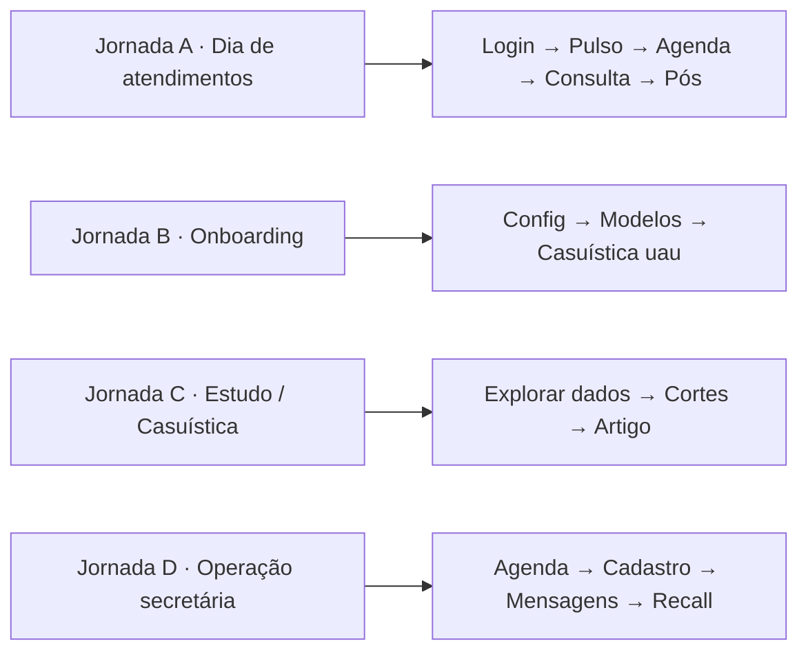
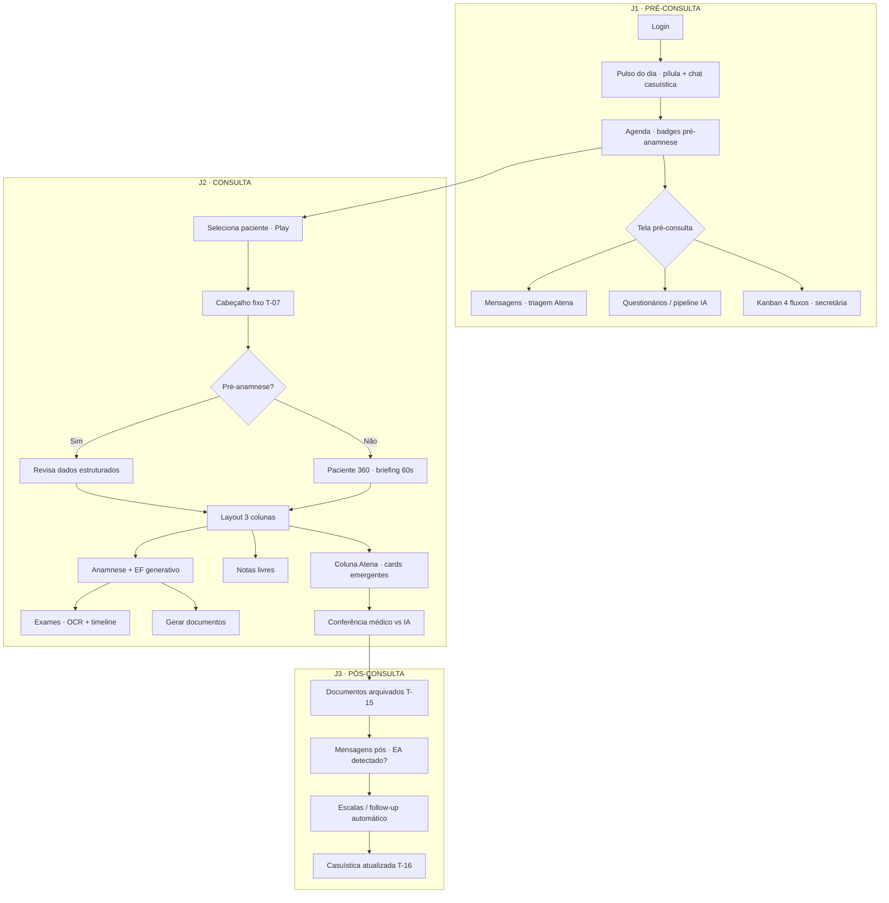
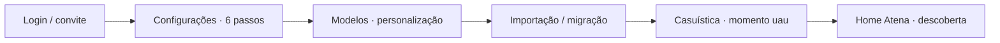
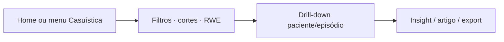
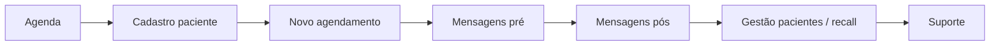

# Userflow · Jornadas da Atena

**WeCann Discovery Pack · Proposta consolidada**  
**Fontes:** Doc 05 (Jornadas UX) · Imersões AtomSix (`inputs/atom_immersion_*.md`) · Demo v107 · Doc 06 (layout consulta) · Doc 04 (gaps MVP)

---

## 1. Propósito deste documento

Este artefato traduz a arquitetura de jornadas do Doc 05 em **fluxos navegáveis** para design e prototipação. Ele cruza o mapa de 21 telas com decisões da imersão WeCann × AtomSix — incluindo o que **não** entra no escopo AtomSix desta fase.

**Audiência:** AtomSix Studio · UX/Design · Product WeCann

**Regra de ouro (Daniel Montagner, imersão interna):**  
Desenhar pelo que o médico **se propõe a fazer**, não por “quadradinhos de processo”. A divisão pré / durante / pós organiza o produto; o protótipo valida **jornadas processuais ponta a ponta**.

---

## 2. Duas lentes complementares

| Lente | Uso | Exemplo |
|-------|-----|---------|
| **Sistêmica** (Doc 05) | Arquitetura de informação, priorização de telas | J1 · J2 · J3 + telas meta T-18–T-21 |
| **Processual** (imersão) | Protótipo, teste, escopo AtomSix (~12 telas) | “Hoje vou atender” do login ao fechamento da consulta |

---

## 3. Mapa de jornadas processuais

Existem **quatro jornadas processuais** principais, não uma só:



**Prioridade AtomSix (imersão):** Jornada A — consulta primeiro; depois pré-operacional; depois pós e legado.

---

## 4. Jornada A · Dia de atendimentos (fluxo principal)

### 4.1 Visão geral



### 4.2 Telas Doc 05 mapeadas

| Passo | Tela Doc 05 | Estado típico | Nota dos inputs |
|-------|-------------|---------------|-----------------|
| Login | — | LIVE | Fora do escopo redesign AtomSix |
| Pulso do dia | T-18 (Home Atena) | PARCIAL | Modal fullscreen na demo v107; pílulas 3–5 min |
| Agenda | T-01 | LIVE | Badges de % pré-anamnese (demo v107) |
| Pré-consulta operacional | T-04, T-05 | LIVE/PARCIAL | Kanban 4×4; uso forte da secretária |
| Cadastro / Agendamento | T-02, T-03 | LIVE | Fluxo secretária (Jornada D) |
| Paciente 360 | T-06 | PARCIAL | Briefing 60s quando sem pré-anamnese |
| Consulta | T-07–T-13 | PARCIAL | **Layout 3 colunas** (Doc 06) |
| Documentos | T-11, T-15 | PARCIAL | 14 tipos (Doc 07) |
| Pós / Mensagens | T-14 | LIVE | Follow-up longitudinal, não só inbox |
| Casuística | T-16 | LIVE | “Momento uau” pós-consulta |
| Gestão pacientes | T-17 | LIVE | Recall, adesão |

### 4.3 Comportamento “vivo” (Eduardo, imersão)

Muitos elementos na consulta **emergem sem clique** — CID sugerido, escalas, alertas de interação, cards na coluna Atena. O userflow deve prever:

1. **Estados dinâmicos** durante J2 (não wireframe estático)
2. **Conferência** explícita ao encerrar: médico valida vs. proposta da IA
3. **Fork silencioso** por especialidade (8 especialidades no Doc 06) e por perfil do paciente (pré-anamnese)

### 4.4 Equilíbrio disruptivo (Daniel)

- Atena presente, mas informação organizada — **não** chat-only na consulta
- Liberar features em camadas: “painel de Airbus no foguete do Musk”
- Médico conservador não pode sentir que perdeu o prontuário; inovador não pode achar “mais um iClinic”

---

## 5. Jornada B · Onboarding (primeiro uso)



| Elemento | Tela | Personas âncora |
|----------|------|-----------------|
| Formulário 6 passos | T-20 | Todas |
| Modelos pré-preenchidos | T-19 | Sênior, Humanista |
| Legado de dados | T-16 | Sênior, Pragmático |
| Copiloto introdutório | T-18 | Recém-formado |

Jornada **paralela** — não é pré-consulta. Ativação e retenção.

---

## 6. Jornada C · Estudo / Casuística



- Personas: **Pragmático** (RWE), **Sênior** (legado), **Humanista** (padrões de cuidado)
- Pode ser ponto de entrada do dia (médico não atende, só estuda)
- Doc 04: visão ideal usa **episódios** e **timepoints** M1/M3/M6/M12 — gap no MVP atual

---

## 7. Jornada D · Operação secretária



| Responsável | O que faz | O que o médico vê |
|-------------|-----------|-------------------|
| Secretária | Kanban, cadastros, agendamento, triagem inicial | Só threads clínicas (Atena triou) |
| Médico | Decisão clínica, documentos, conferência IA | Agenda com contexto, não operação |

---

## 8. Vertical slice recomendado (escopo AtomSix)

Protótipo navegável mínimo — **worst case por persona**:

```
Login → Agenda → Selecionar paciente → Play consulta
  → [Pré-anamnese OU Paciente 360]
  → Consulta 3 colunas (Anamnese/EF | Notas | Atena)
  → Gerar documento
  → Conferência médico vs IA
  → Mensagem pós-consulta
```

**~12 telas** (briefing AtomSix externo) — não cobrir financeiro, app paciente completo, nem todos os 50 estados de cada tela.

**Critério “nova tela”:** modificação visual > 70% (imersão).

**Estados por tela:** mapear só os estados **usados no fluxo** escolhido — não todos os estados possíveis.

---

## 9. Personas × momento da jornada

| Persona | Ganha mais em | Implicação no fluxo |
|---------|---------------|---------------------|
| Pragmático | J3 Casuística + cortes RWE | Entrada rápida na agenda; pós mínimo |
| Sobrecarregado | J1 triagem + J2 docs 1-clique | Pulso opcional; máxima automação J2/J3 |
| Recém-formado | J2 Atena + onboarding | Conferência IA; tooltips “por quê?” |
| Sênior | J3 casuística + J1 pílulas curtas | Fonte grande; poucos cliques |
| Humanista | J2 tempo livre + J1 conversa | Atena preenche; médico olha para o paciente |

---

## 10. Decisões dos inputs que impactam o desenho

| Tema | Fonte | Impacto |
|------|-------|---------|
| Pulso do dia como entrada do dia | Imersão + demo v107 | J1 começa antes da agenda |
| Kanban pré-consulta 4×4 | demo v107 | J1 tem visão operacional além de inbox |
| Conferência humano × IA | briefing AtomSix | Passo ao encerrar consulta |
| Layout 3 colunas | Doc 06 | J2 é composição fixa, não tela única |
| Episódio > consulta avulsa | Doc 04 (gap) | J2/J3 devem evoluir para episódio + timepoint |
| Financeiro | Doc 05 Fase 2 | Fora do userflow AtomSix atual |
| App do paciente | briefing externo | Pré-anamnese e docs sim; redesign app não |
| Prontuário que ensina | imersões | Pílulas em J1, cards Atena em J2, insights em J3 |

---

## 11. Gaps MVP vs userflow ideal (Doc 04)

O userflow proposto **mostra o norte**. O MVP atual ainda diverge em:

- Entidade primária: **consulta** vs. **episódio terapêutico**
- Timepoints M1/M3/M6/M12 não visíveis na UI
- Chip bifacial de qualidade de dados
- Wizard de visita basal (campos dispersos hoje)

Esses gaps não bloqueiam o protótipo AtomSix, mas devem constar como **evolução** no mapa.

---

## 12. Tensão a resolver no projeto

| Visão | Quem | Proposta de síntese |
|-------|------|---------------------|
| 3 tempos clínicos (pré/durante/pós) | Patrícia / Doc 05 | Arquitetura de informação e navegação |
| Jornadas por intenção do médico | Daniel | Protótipo e teste de usabilidade |
| Consulta primeiro | Patrícia + AtomSix | Prioridade de redesign |

**Resultado:** Doc 05 organiza o território; este userflow define **por onde cortar o protótipo**.

---

## 13. Próximos passos sugeridos

1. Validar com WeCann o vertical slice das 12 telas
2. Prototipar Jornada A com estados dinâmicos (consulta viva)
3. Definir estados do kanban pré-consulta e do Pulso do dia
4. Especificar passo de conferência médico × IA no fechamento
5. Documentar fork por especialidade (8) no layout 3 colunas
6. Planejar evolução episódio/timepoint (pós-AtomSix)

---

*WeCann Discovery Pack · Userflow Jornadas · v1 · Jun 2026*
